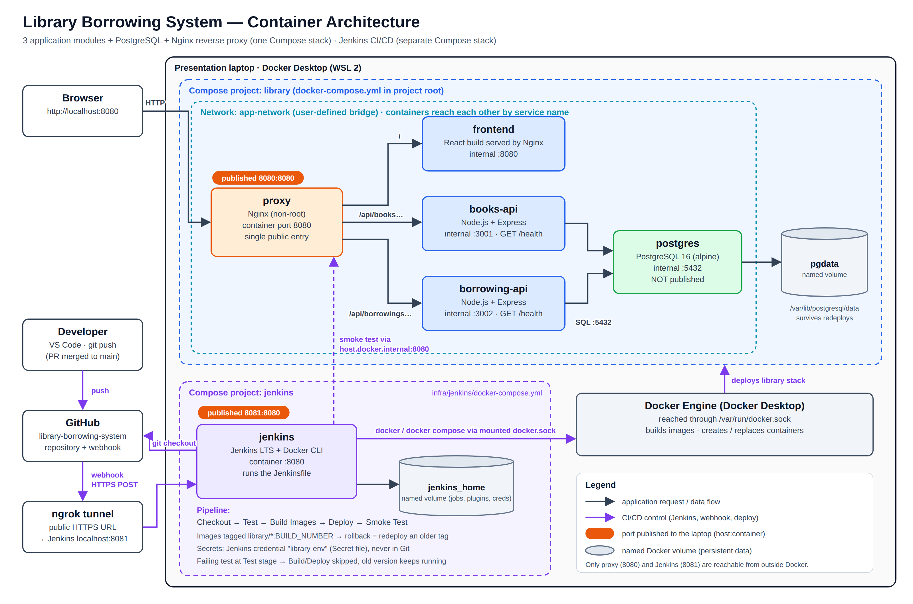

# Library Borrowing System

A small library borrowing application used to demonstrate a **containerized
infrastructure with automated CI/CD** for the System Architecture and
Integration final project. Every part runs in Docker, and every push to `main`
is automatically tested, built, deployed, and smoke-tested by Jenkins.

## Modules

| Module | Technology | Responsibility | Internal port |
| --- | --- | --- | --- |
| `frontend` | React (Vite), served by Nginx | List/add books, borrow and return, show borrowing records and the build number | 8080 |
| `books-api` | Node.js + Express | Book records (`/books`) | 3001 |
| `borrowing-api` | Node.js + Express | Borrow / return logic (`/borrowings`) | 3002 |

Infrastructure containers: **PostgreSQL 16** (database, named volume `pgdata`),
**Nginx** reverse proxy (the only public entry point), and **Jenkins** (CI/CD, separate Compose stack).

## Technology choices

| Component | Choice | Why |
| --- | --- | --- |
| Frontend | React + Vite | Component-based UI; builds to static files Nginx can serve |
| Backend | Node.js + Express | Used in our API lab; small and easy to test |
| Database | PostgreSQL 16 | Relational data (books and borrowings linked by a foreign key) |
| Reverse proxy | Nginx | One public entry point that routes by URL path |
| Containers | Docker + Docker Compose | Same environment everywhere; one command starts the stack |
| CI/CD | Jenkins in Docker | Pipeline as code (Jenkinsfile) that tests, builds, and deploys |
| Trigger | GitHub webhook + ngrok | Jenkins starts within seconds of a push |
| Tests | Jest + Supertest | Route tests without a running server; failures stop the pipeline |

## Ports

| Service | URL / port | Public? |
| --- | --- | --- |
| Application (Nginx proxy) | http://localhost:8080 | Yes |
| Jenkins | http://localhost:8081 | Yes (lab laptop only) |
| books-api, borrowing-api, frontend, postgres | internal only | No |

## Prerequisites

- Windows 10/11 with Docker Desktop (WSL 2 engine)
- Git
- Node.js 20+ (only for running modules outside Docker)

## Run the application

From the project root in PowerShell:

    Copy-Item .env.example .env      # then edit .env and set your own password
    docker compose up -d --build
    docker compose ps                 # all 5 services should be "healthy"

Open http://localhost:8080.

Stop without losing data: `docker compose down`
(Never use `docker compose down -v` unless you want to erase the database.)

## Environment variables

| Variable | Purpose |
| --- | --- |
| `POSTGRES_USER` | Database user created on first start; used by both APIs |
| `POSTGRES_PASSWORD` | That user's password (only in `.env`, never committed) |
| `POSTGRES_DB` | Database name created on first start |

`.env` is git-ignored. Only `.env.example` (placeholders) is in the repository.

## API (through the proxy)

| Method | Path | Success | Errors |
| --- | --- | --- | --- |
| GET | `/api/books/health` | 200 | - |
| GET | `/api/books` | 200 | 500 |
| GET | `/api/books/:id` | 200 | 400, 404 |
| POST | `/api/books` | 201 | 400 |
| PUT | `/api/books/:id` | 200 | 400, 404 |
| GET | `/api/borrowings/health` | 200 | - |
| GET | `/api/borrowings` | 200 | 500 |
| POST | `/api/borrowings` | 201 | 400, 404, 409 (no copies) |
| PUT | `/api/borrowings/:id/return` | 200 | 400, 404, 409 (already returned) |

## Tests

    cd books-api;     npm install; npm test
    cd borrowing-api; npm install; npm test

The same tests run inside Docker (`docker build --target test ./books-api`),
which is what Jenkins does in the Test stage.

## CI/CD with Jenkins

Start Jenkins (separate stack, so the pipeline never redeploys Jenkins itself):

    cd infra\jenkins
    docker compose up -d --build

Open http://localhost:8081, install the suggested plugins plus **Docker Pipeline**,
and add a **Secret file** credential with ID `library-env` containing the `.env`.

Pipeline (`Jenkinsfile`):

| Stage | What it does | If it fails |
| --- | --- | --- |
| Checkout | Gets the pushed commit | Nothing else runs |
| Test | Runs Jest inside Docker for both APIs | Build and Deploy are skipped; the old version keeps running |
| Build Images | Builds all images tagged with the Jenkins build number | Nothing is deployed |
| Deploy | `docker compose up -d --wait` with the new images | Previous containers may be replaced |
| Smoke Test | Checks the frontend and both `/health` endpoints through Nginx | Build marked failed for investigation |

### Automatic trigger

GitHub webhook -> ngrok HTTPS URL -> Jenkins `/github-webhook/`.
The job has "GitHub hook trigger for GITScm polling" enabled and builds branch `main`.
Fallback: Poll SCM `H/2 * * * *`.

### Rollback

Every build's images are tagged with its build number. To redeploy build 12:

    $env:TAG = "12"
    docker compose up -d --no-build --wait
    Remove-Item Env:TAG

Or run the optional `library-rollback` Jenkins job (`Jenkinsfile.rollback`) with `ROLLBACK_TAG=12`.

## Security note

Jenkins mounts `/var/run/docker.sock` and runs as root so it can control Docker.
This is acceptable for a classroom lab but gives Jenkins full control of the host.
In production we would use dedicated build agents, rootless Docker,
Docker-in-Docker with TLS, or Kaniko.

## Team

| Member | Role |
| --- | --- |
| De Guzman | Project Lead / Scrum Master |
| Corpuz | DevOps / CI-CD Engineer |
| Imperial | Infrastructure Engineer |
| Fajardo | Backend and Database Engineer |
| Verona | Frontend, QA and Documentation Lead |

## Workflow

GitHub Issue -> feature branch -> commit -> push -> Pull Request -> review -> merge into `main`.
Never commit `.env`, passwords, or `node_modules`.